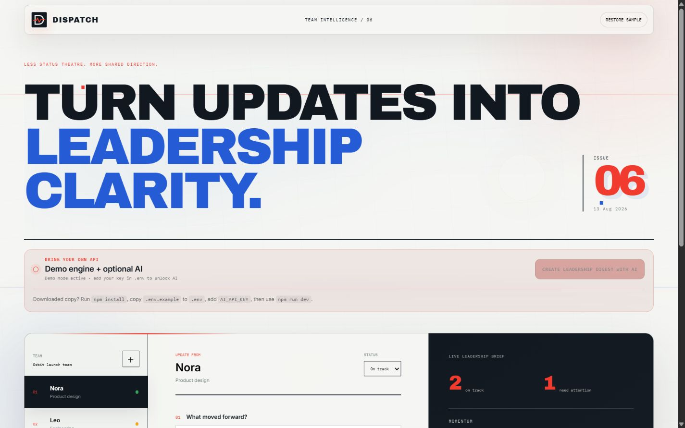

# Dispatch — Team Update Digest

Collect structured team updates and convert them into leadership-ready progress, blockers, decisions, and next moves. Project 06 in the Jamil Darwish Automation Lab.

[](https://github.com/Jamilof1/team-update-digest/actions/workflows/ci.yml)
[View in Jamil Darwish's portfolio](https://jamildarwish.com/#automation-lab) · [MIT License](./LICENSE)



## Modes

- **Demo:** visible local rules organize updates immediately.
- **AI:** your model creates a concise leadership digest from the current team board through the local API proxy.

## Quick start

Requires Node.js 22+.

```bash
git clone https://github.com/Jamilof1/team-update-digest.git
cd team-update-digest
npm install
npm run dev
```

To enable AI, copy `.env.example` to `.env`, add `AI_API_KEY`, then restart. PowerShell: `Copy-Item .env.example .env`.

## Provider configuration

Defaults: OpenAI Responses API and `AI_MODEL=gpt-5`. Compatible chat endpoints can set `AI_BASE_URL`, `AI_MODEL`, and `AI_API_STYLE=chat`. Keys remain in the local server process and `.env` is never committed.

## Features

- Per-person progress, next step, blocker, decision, and health capture.
- Team health overview and leadership digest.
- Add/remove teammates and copy a Markdown report.
- Optional AI synthesis with evidence-preserving guidance.

## Commands

`npm run dev` starts both processes, `npm test` runs tests, `npm run build` creates `dist/`, and `npm start` serves the built app + API.

## Privacy and limitations

Demo data stays in page memory. AI mode sends the current team board only after an explicit click. Inform employees, minimize personal data, follow workplace policies, and verify every summary and attribution before sharing it.

MIT — built by [Jamil Darwish](https://jamildarwish.com/).
